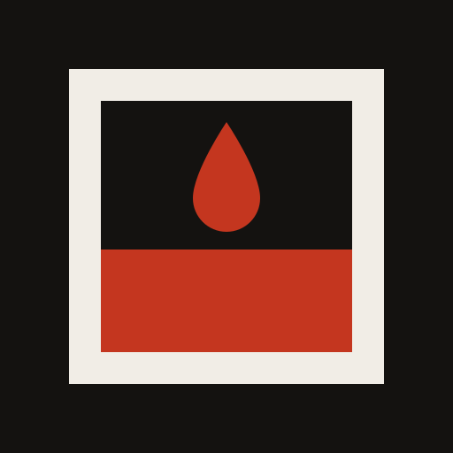
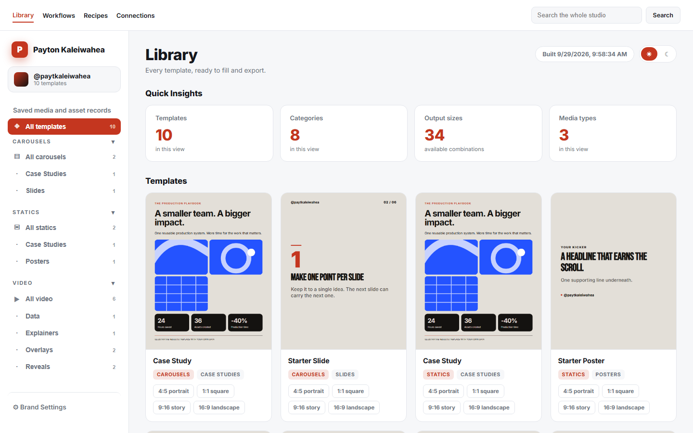
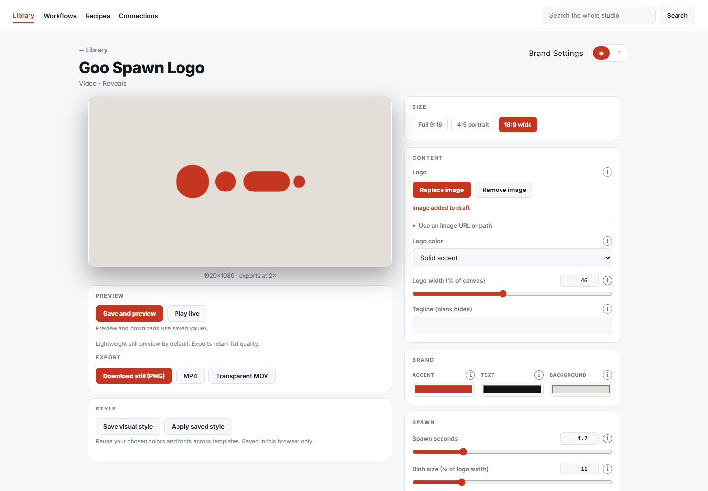

<p align="center">
  
</p>

<h1 align="center">Brand Foundry</h1>

<p align="center">
  <b>Templates your AI agents fill.</b><br>
  Branded images, carousels and video, made on your machine and kept in your library.
</p>

<p align="center">
  Created by <a href="https://x.com/paytkaleiwahea"><b>Payton Kaleiwahea</b></a> at <a href="https://bbm.media">Business Based Media</a>
</p>

<p align="center">
  <a href="https://x.com/paytkaleiwahea"></a>
  <a href="LICENSE"></a>
  
  <a href="CHANGELOG.md"></a>
  <a href="skills/brand-foundry/SKILL.md"></a>
</p>

<p align="center">
  
</p>

---

When you make something good with Claude, ChatGPT or Codex, it usually disappears into a chat
log. Brand Foundry turns it into a **template you own**. Describe an asset once, and you or
your agent can fill it forever: new words, new photos, every size, always on brand.

The animation above was rendered by Brand Foundry, from the included **Goo Spawn** template.

## Install

### With your agent

**Claude Code:**

```
/plugin marketplace add bbm-media/brand-foundry
/plugin install brand-foundry@brand-foundry
```

**Codex, Cursor, Gemini CLI and other [Agent Skills](https://agentskills.io) apps:**

```bash
npx skills add bbm-media/brand-foundry -g
```

Then send your agent:

```text
Use Brand Foundry to make a 9:16 title card that says "Every frame counts."
```

It sets the studio up on your machine if it is not there yet, asking first, then renders the file and tells you where it is. Keep going: *"Make a 16:9 version"*, *"Animate my logo with Goo Spawn as a transparent MOV"*, *"Save that as a template I can reuse."*

### By hand

**Download and double-click.** Grab the ZIP from the [latest release](https://github.com/bbm-media/brand-foundry/releases/latest),
extract it, and open **Start Brand Foundry.bat** (Windows) or run
`sh "Start Brand Foundry.command"` (macOS). The launcher installs what it needs on first run,
builds your templates and opens your browser. Keep its window open while you work.

**Or clone it:**

```bash
git clone https://github.com/bbm-media/brand-foundry.git
cd brand-foundry
npm start          # builds templates, then serves http://127.0.0.1:4800
```

You need **Node.js 22 or newer**. PNG export uses Chrome. Video export also uses FFmpeg and
FFprobe; see [video export setup](#video-export-setup). Run `npm run doctor` to check everything.

First launch offers a short brand setup. Skip it if you just want to explore the included
templates first; **Brand Settings** is always one click away.

## What you get

- **Stills:** carousels and posters exported as PNG at 4:5, 1:1 and 9:16.
- **Motion:** overlays, lower thirds, stat hits and reveals exported as MP4, or as a
  **transparent MOV** that drops straight onto a Premiere or Resolve timeline.
- **Your brand, set once:** colors, fonts and handle apply to every template automatically.
- **Built for agents:** Claude Code and Codex can write new templates, fill existing ones and
  render them through a local API. Instructions for both ship in the repo.
- **Local and deterministic:** no design SaaS, no per-asset cost, no image model in the render
  path. Same input, same output, every time.

<p align="center">
  
</p>

<p align="center">
  
</p>

## Why this exists

I'm a content creator who learned the tech. There are plenty of technical people who understand content, but not many creatives who understand the tech, and I kept hitting the same wall.

Generative tools like Higgsfield and Magnific are amazing, but they're non-deterministic. Every generation comes out a little different. You re-prompt, add guidelines, and still can't recreate last week's asset exactly. You never have full control.

Then Remotion, and later HyperFrames, turned video into HTML, CSS and JavaScript. If motion graphics are code, anything a website can show can become an asset, and the same input gives you the same output every time.

Creators already live in asset libraries: Artlist, Envato Elements, Storyblocks. But when it comes to valuing a media company, key-man risk is real. If everything lives in one person and a stock subscription, there isn't much to value. You shoot your own B-roll; you should make your own assets too, and own a library that's unique to you. Generation credits aren't free either. They're subsidized right now, and nobody knows what they'll cost later. A template you own costs nothing to render again.

The last piece is the agents. With Claude Code or Codex driving Premiere Pro and DaVinci Resolve, you can direct an edit by voice. You shoot the creative, your agent fills the templates, and the overlays land on the timeline. Brand Foundry is the asset layer for that.

Building this blew my mind. I hope it does the same for you.

[Payton Kaleiwahea](https://github.com/paytkaleiwahea)

## Included templates

| Media | Template | Exports |
|---|---|---|
| Carousels | Case Study · Starter Slide | PNG |
| Statics | Case Study · Starter Poster | PNG |
| Video · Overlays | Speaker Nameplate · Starter Headline | PNG, MP4, transparent MOV |
| Video · Data | Stat Spotlight · Bar Race | PNG, MP4, transparent MOV |
| Video · Explainers | Three Step Process | PNG, MP4, transparent MOV |
| Video · Reveals | Goo Spawn Title · Goo Spawn Logo · Aurora Title | PNG, MP4, transparent MOV |
| Video · Typography | Kinetic Slam · Mask Reveal · Slot Roll · Line Draw · Marquee Bands · Word Drum | PNG, MP4, transparent MOV |
| Video · Transitions | Shape Burst · Tile Wipe | MP4, transparent MOV |
| Video · Product | Product Showcase · Screen Zoom · Prompt Box | PNG, MP4, transparent MOV |
| Video · Social | Quote Card | PNG, MP4, transparent MOV |
| Video · Endcards | Follow CTA | PNG, MP4, transparent MOV |

## Make your own template with AI

Paste **[TEMPLATE-GUIDE.md](docs/TEMPLATE-GUIDE.md)** into Claude, ChatGPT or any capable model,
describe the asset you want, and save what it gives you as
`templates/<media>/<category>/<name>.html`. Run `npm run build` and it appears in your library.

Folders are the navigation: add a folder under `templates/video/` and it becomes a new
category in the sidebar, with no code change.

## Use it with agents

- **Claude Code** reads [CLAUDE.md](CLAUDE.md); **Codex** reads [AGENTS.md](AGENTS.md). Both
  point to the same shared instructions.
- The skill lives at [skills/brand-foundry/SKILL.md](skills/brand-foundry/SKILL.md) and installs with one
  command; see [Install](#install).
- [AGENT-WORKFLOW.md](docs/AGENT-WORKFLOW.md) shows the local API: pick a template, send field values,
  get back a PNG, MP4 or MOV, and hand it to Premiere or Resolve.

The connection is your running local server plus file access to this folder. No MCP server
is bundled, and a cloud agent cannot reach your `localhost` on its own. See
[CLOUD-ACCESS.md](docs/CLOUD-ACCESS.md) for self-hosting.

This repository is itself built by Claude Code and Codex working side by side. The rules they
follow are in [AGENTS.md](AGENTS.md).

## Video export setup

`npm install` pulls in the HyperFrames renderer. FFmpeg and FFprobe are native programs you
install once:

```powershell
# Windows
winget install --id Gyan.FFmpeg -e
```

```bash
# macOS
brew install ffmpeg

# Ubuntu / Debian
sudo apt update && sudo apt install -y ffmpeg
```

Then restart the studio and run `npm run doctor`. If Chrome is not found, set `CHROME_PATH`.

## Commands

| Command | What it does |
|---|---|
| `npm start` | Build templates, then serve the studio |
| `npm run doctor` | Check Chrome, FFmpeg and the video renderer |
| `npm run setup` | Configure your brand and categories from the terminal |
| `npm run build` | Rebuild templates and the manifest |
| `npm run serve` | Serve without rebuilding |
| `npm run clean` | Clear generated builds and the thumbnail cache |

## Docs

| Read this | When you want to |
|---|---|
| [USER-GUIDE.md](docs/USER-GUIDE.md) | Create, save, export and share, step by step |
| [START-HERE.md](docs/START-HERE.md) | Install from a download, or fix setup problems |
| [ONBOARDING.md](docs/ONBOARDING.md) | Set up your brand with a wizard, or let an AI interview you |
| [TEMPLATE-GUIDE.md](docs/TEMPLATE-GUIDE.md) | Write templates, by hand or with AI |
| [IMPORTING-TEMPLATES.md](docs/IMPORTING-TEMPLATES.md) | Bring in templates someone else shared |
| [docs/HOW-IT-WORKS.md](docs/HOW-IT-WORKS.md) | Understand the render pipeline, caching, drafts and layout |
| [docs/UPDATING.md](docs/UPDATING.md) | Update without losing your library |
| [DEPLOY.md](docs/DEPLOY.md) | Host it on your own server |

## Contributing

The easiest contribution is a template: one HTML file in one pull request. See
[CONTRIBUTING.md](CONTRIBUTING.md). Bug reports and ideas are welcome in the issues.

## Who made this

Brand Foundry was created by **Payton Kaleiwahea**. Follow [@paytkaleiwahea](https://x.com/paytkaleiwahea)
on X for new templates, the tools coming next, and how it all gets built.

It is the first open tool from **[Business Based Media](https://bbm.media)**: open systems for
making content, with research, media, post-production, copywriting and thumbnail agents to
follow.

**Rather not run it yourself?** BBM runs the whole media department for you, turning one
recorded session into a month of content. [bbm.media](https://bbm.media)

MIT licensed. Use it, fork it, sell what you make with it.
